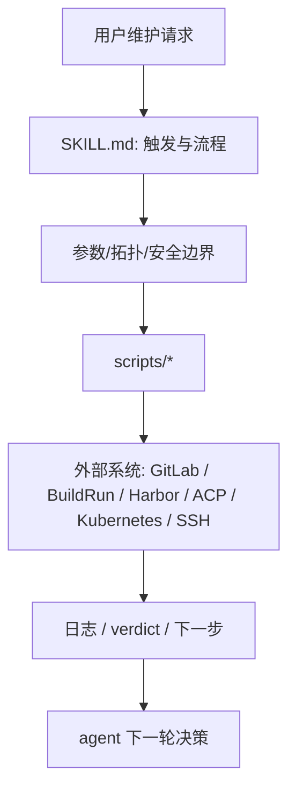
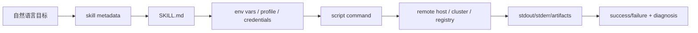
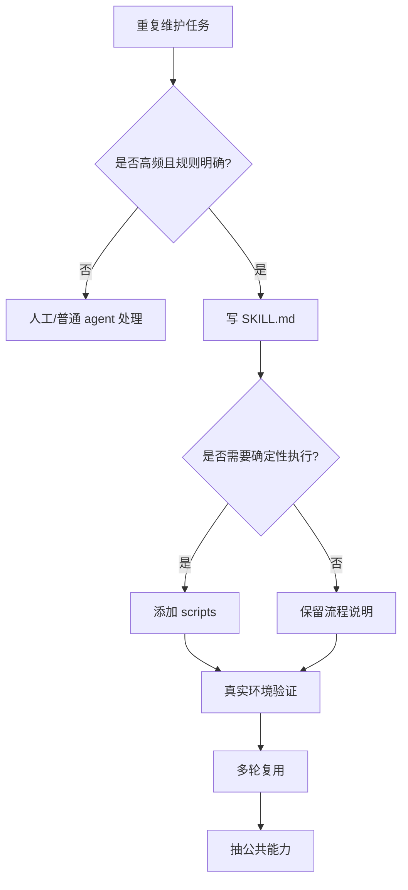

# fy-skills 维护导读

面向需要理解和复用本地 agent skill 工作流的维护者。

## 一句话定位

`fy-skills` 是可执行维护工作流样例库。它不直接交付 HAMi 产品，而是沉淀“代码到集群验证”“镜像导入”“节点 SSH bootstrap”“bundle 同步”等重复操作，让 agent 可以通过 skill 触发稳定流程。

当前它为 HAMi 维护自动化提供范式：每个 skill 都有清晰触发条件、拓扑、参数、脚本、错误处理和输出契约。

## 自顶向下

从维护工作看，`fy-skills` 解决的是“把人工步骤变成可复用工作流”：

1. 用户用自然语言触发某个维护目标。
2. skill 文档把目标转换成明确参数和拓扑。
3. scripts 执行确定性步骤。
4. 输出可复查的结果、失败阶段和下一步建议。
5. 多轮迭代时继续复用同一 skill，而不是重写临时命令。

## 自底向上

关键 skill：

| Skill | 路径 | 作用 |
|---|---|---|
| `bundle-iterate` | `bundle-iterate` | OLM bundle 从代码、构建、violet package/push 到目标 ACP 安装验证的闭环 |
| `cluster-image-import` | `cluster-image-import` | 经跳板机把外部/构建仓库镜像导入隔离集群 registry |
| `node-ssh-bootstrap` | `node-ssh-bootstrap` | 通过 `kubectl debug node` 给不可 SSH 的 KubeOS 节点安装 root 公钥 |
| `sync-bundle` | `sync-bundle` | 包装 `violet create/package/push`，同步 bundle 到 Alauda 平台 catalog |

## 架构层级图



## 数据流图



## 操控流程图



## Alauda CI 构建逻辑

本项目没有 Alauda `.build/build.yaml`。它不是产品制品仓库，不走 build-harbor/chart-harbor 交付。

它对 Alauda CI 的价值在于：

- `bundle-iterate` 可作为 Katanomi BuildRun 后续安装验证模板。
- `cluster-image-import` 可补足隔离集群镜像导入。
- `sync-bundle` 可把 bundle 制品推入 ACP catalog。
- 这些模式可以被 HAMi 维护 skill 复用，但不要把环境私密参数硬编码进产品仓库。

## 常用维护入口

阅读顺序：

```text
fy-skills/README.md
bundle-iterate/SKILL.md
cluster-image-import/SKILL.md
node-ssh-bootstrap/SKILL.md
sync-bundle/SKILL.md
```

典型复用点：

- HAMi 代码到集群闭环借鉴 `bundle-iterate` 的“单轮 iteration + verdict”模式。
- 隔离集群镜像导入借鉴 `cluster-image-import` 的“显式跳板机参数 + 脚本封装”模式。
- 无 SSH 节点调试借鉴 `node-ssh-bootstrap` 的“kubectl debug node + hostPath rootfs”模式。

## 维护注意事项

- skill 文档要说明何时使用、何时不要使用。
- 操作集群/registry/ACP 的 skill 必须明确 mutation 风险。
- 脚本只保存流程，不保存密钥。
- 输出必须包含输入摘要、执行结果、失败阶段和下一步。
- 公共能力不要过早抽象，至少经过几次真实重复后再拆分。
